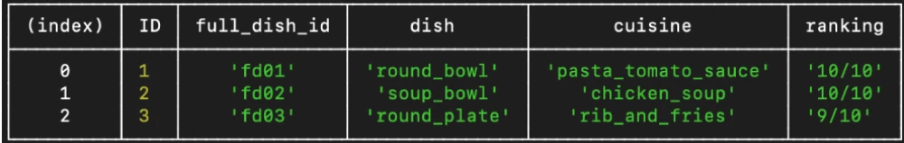

# Functions that convert minutes and hours to seconds / SQl

Week 2, Day 2. connecting mySQL with JavaScript using Node for homework and using functions.

## Lesson Learned
1. Node
2. NPM
3. MySQL
4. JavaScript
5. Depth into functions

To see the repo [click here](https://github.com/IdanFischer/homework-week-02).
